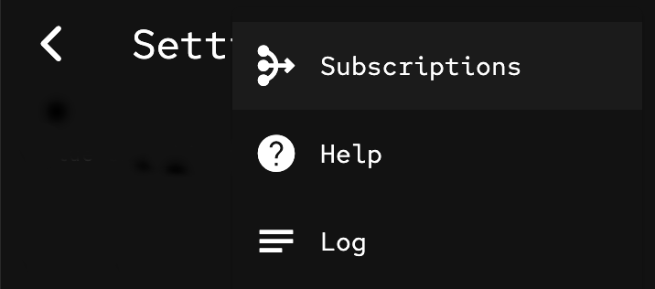

An extension to the Flutter AppBar that allows many "IconButton"s to be added to the "actions:" list and will place some of them in a dropdown menu if the screen is too narrow.

## Example

```dart
import 'package:actions_menu_appbar/actions_menu_appbar.dart';

  @override
  Widget build(BuildContext context) {

    return Scaffold(
      appBar: ActionsMenuAppBar(
        actionsPercent: 0.5, // The fraction of the screen width to use for the action buttons.
        context: context,
        title: const Text("Settings"),
        actions: [
          IconButton(icon: const Icon(Icons.power_settings_new, semanticLabel: 'Exit'), onPressed: () {}),
          IconButton(icon: const Icon(Icons.share, semanticLabel: 'Export'), onPressed: () {}),
          IconButton(icon: const Icon(Icons.file_open, semanticLabel: 'Import'), onPressed: () {}),
          IconButton(icon: const Icon(Icons.mediation, semanticLabel: 'Subscriptions'),onPressed: () {}),
          IconButton(icon: const Icon(Icons.help, semanticLabel: 'Help'), onPressed: () {}),
          IconButton(icon: const Icon(Icons.notes, semanticLabel: 'Log'),onPressed: () {})
        ],
      ),
      body: Container()
    );
  }
```

On a wide screen the action buttons will all be displayed:


On a narrower screen some of the action buttons will be moved into a dropdown menu:


The menu shows the additional actions when it is dropped down:


